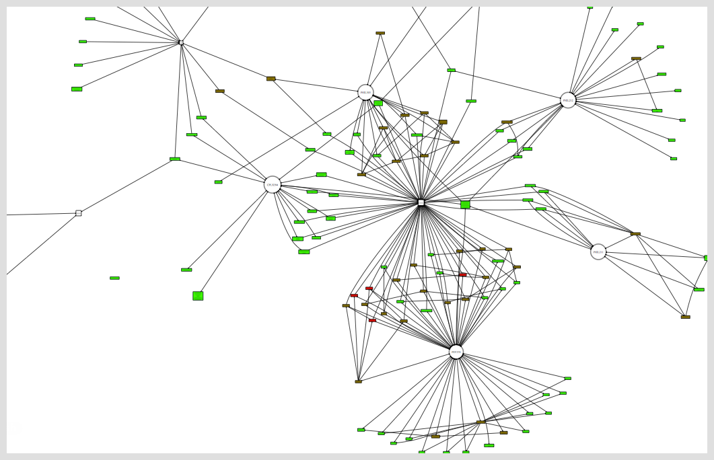

# taskgv
Generates a pretty, directed graph of [Taskwarrior](http://taskwarrior.org) projects, tags, and tasks.  After the graph has been generated, it's opened using either `xdg-open` (under GNU/Linux) or `open` (under OS X).

Things end up looking kinda like this:

Arrows show implication, so they point from projects to tasks, and from tasks to tags. That is, projects _include_ tasks and tasks _include_ tags.

Projects are represented by large circles, tasks by colored rectangles, and tags by uncolored squares.

## Requirements

* Either of the `xdg-open` or `open` commands, present by default on most GNU/Linux or OS X installs, respectively.
* Python

* Taskwarrior

* [Graphviz](http://www.graphviz.org/)'s `digraph` command.

## Usage

When placed in your $PATH, `taskgv.py <filter>` opens a graph of your business, filtered by Taskwarrior `<filter>`.

## Integration

This command can be integrated with Taskwarrior by either running `task config alias.gv execute taskgv.py` or adding the line `alias.gv=execute taskgv.py` to your `.taskrc`.
In either case, the result will be the ability to call taskgv with the command `task gv`.

### Credit

This script is derived from [graphdeps.py](http://taskwarrior.org/projects/taskwarrior/wiki/ExternalScripts#graphdepspy).
